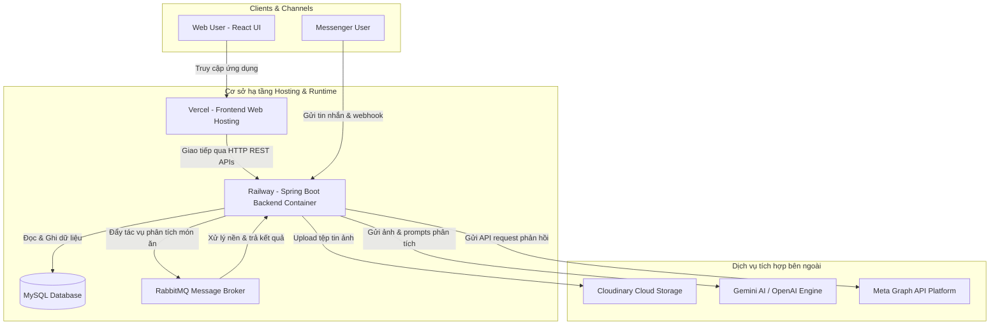
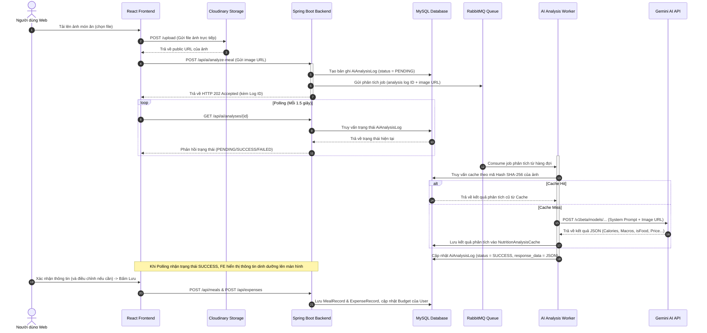
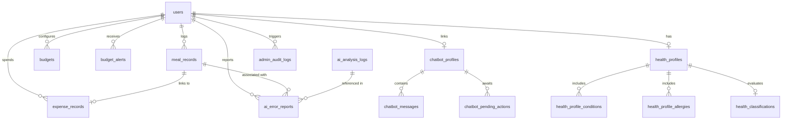

# NutriWallet - Hệ thống Theo dõi Dinh dưỡng & Chi tiêu Ăn uống Thông minh

NutriWallet là hệ thống hỗ trợ người dùng quản lý sức khỏe dinh dưỡng cá nhân kết hợp kiểm soát tài chính ăn uống hàng ngày. Dự án giải quyết bài toán nhập liệu thủ công tốn thời gian bằng cách tích hợp trí tuệ nhân tạo (Gemini AI) giúp tự động phân tích thành phần dinh dưỡng và chi phí từ ảnh món ăn được tải lên qua Web hoặc gửi qua Facebook Messenger Chatbot.

---

## 📌 Mục lục
- [1. Giới thiệu chung](#1-giới-thiệu-chung)
- [2. Tính năng chính](#2-tính-năng-chính)
  - [Dành cho người dùng (Web Client)](#dành-cho-người-dùng-web-client)
  - [Dành cho chatbot Facebook Messenger](#dành-cho-chatbot-facebook-messenger)
  - [Dành cho Quản trị viên (Admin Console)](#dành-cho-quản-trị-viên-admin-console)
- [3. Đối tượng và vai trò hệ thống](#3-đối-tượng-và-vai-trò-hệ-thống)
- [4. Quy trình nghiệp vụ chính](#4-quy-trình-nghiệp-vụ-chính)
  - [Luồng phân tích món ăn trên website](#luồng-phân-tích-món-ăn-trên-website)
  - [Luồng xử lý chatbot Facebook Messenger](#luồng-xử-lý-chatbot-facebook-messenger)
  - [Luồng xác thực người dùng](#luồng-xác-thực-người-dùng)
  - [Luồng báo cáo lỗi AI](#luồng-báo-cáo-lỗi-ai)
- [5. Sơ đồ luồng hệ thống](#5-sơ-đồ-luồng-hệ-thống)
  - [Sơ đồ kiến trúc tổng thể](#sơ-đồ-kiến-trúc-tổng-thể)
  - [Sơ đồ trình tự (Sequence Diagram) quét ảnh AI](#sơ-đồ-trình-tự-sequence-diagram-quét-ảnh-ai)
- [6. Kiến trúc hệ thống và Tổ chức Layer](#6-kiến-trúc-hệ-thống-và-tổ-chức-layer)
- [7. Công nghệ sử dụng](#7-công-nghệ-sử-dụng)
- [8. Cấu trúc thư mục dự án](#8-cấu-trúc-thư-mục-dự-án)
- [9. Mô hình dữ liệu (Database Schema)](#9-mô-hình-dữ-liệu-database-schema)
  - [Bảng Entity/Table chính](#bảng-entitytable-chính)
  - [Sơ đồ quan hệ thực thể (ERD)](#sơ-đồ-quan-hệ-thực-thể-erd)
- [10. Tổng quan API](#10-tổng-quan-api)
- [11. Yêu cầu hệ thống](#11-yêu-cầu-hệ-thống)
- [12. Hướng dẫn cài đặt và khởi chạy](#12-hướng-dẫn-cài-đặt-và-khởi-chạy)
  - [Khởi động Cơ sở hạ tầng (Docker)](#khởi-động-cơ-sở-hạ-tầng-docker)
  - [Khởi chạy Backend (Local)](#khởi-chạy-backend-local)
  - [Khởi chạy Frontend (Local)](#khởi-chạy-frontend-local)
- [13. Cấu hình biến môi trường](#13-cấu-hình-biến-môi-trường)
  - [File cấu hình mẫu](#file-cấu-hình-mẫu)
  - [Khác biệt giữa các môi trường chạy](#khác-biệt-giữa-các-môi-trường-chạy)
- [14. Hướng dẫn cấu hình Facebook Messenger Webhook](#14-hướng-dẫn-cấu-hình-facebook-messenger-webhook)
- [15. Cơ chế phân tích hình ảnh qua Gemini AI](#15-cơ-chế-phân-tích-hình-ảnh-qua-gemini-ai)
- [16. Kiểm thử (Testing)](#16-kiểm-thử-testing)
- [17. Tài khoản dùng thử (Demo)](#17-tài-khoản-dùng-thử-demo)
- [18. Thành viên dự án và Phân chia công việc](#18-thành-viên-dự-án-và-phân-chia-công-việc)
- [19. Git workflow & Branching Strategy](#19-git-workflow--branching-strategy)
- [20. Hạn chế hiện tại và Định hướng phát triển](#20-hạn-chế-hiện-tại-và-định-hướng-phát-triển)
- [21. Contributors & Bản quyền (License)](#21-contributors--bản-quyền-license)

---

## 1. Giới thiệu chung

Dự án **NutriWallet** là một giải pháp chuyển đổi số hỗ trợ người dùng theo dõi lối sống lành mạnh. 

*   **Vấn đề dự án giải quyết**: Ghi chép nhật ký ăn uống và chi tiêu truyền thống đòi hỏi người dùng tự tra cứu lượng calo, các chất dinh dưỡng vi lượng (Carbs, Protein, Fat) và tự cộng tổng số tiền đã chi tiêu cho ăn uống. Quy trình thủ công này tốn thời gian và dễ bị bỏ dở.
*   **Giải pháp của NutriWallet**: Người dùng chỉ cần chụp ảnh món ăn tải lên hệ thống. AI sẽ tự động nhận dạng món ăn, phân tích các chỉ số dinh dưỡng (Calories, Carbs, Protein, Fat) và ước lượng chi phí trung bình. Kết quả phân tích được lưu trữ đồng bộ vào cơ sở dữ liệu giúp theo dõi trực quan dưới dạng biểu đồ chi tiêu và dinh dưỡng.
*   **Đối tượng người dùng**: Người có nhu cầu giảm cân/tăng cân, người cần kiểm soát chi tiêu ăn uống hàng tháng, và quản trị viên vận hành hệ thống.
*   **Trạng thái dự án**: Đang phát triển hoàn thiện các tính năng cốt lõi (MVP) và chuẩn bị thử nghiệm tích hợp sâu.


---

## 2. Tính năng chính

### Dành cho người dùng (Web Client)
*   **Đăng nhập mạng xã hội**: Xác thực bảo mật qua tài khoản Google và Facebook thông qua giao thức OAuth2.
*   **Thiết lập hồ sơ sức khỏe (Onboarding & Health Profile)**: Thu thập thông tin chiều cao, cân nặng, độ tuổi, mức độ vận động cùng các hạn chế y tế (dị ứng, bệnh lý nền) để cá nhân hóa chỉ số dinh dưỡng đích.
*   **Quét ảnh món ăn bằng AI**: Tải ảnh món ăn trực tiếp lên Cloudinary, gửi liên kết ảnh để AI phân tích và trả về thành phần dinh dưỡng ước lượng.
*   **Xác nhận và chỉnh sửa**: Người dùng có thể điều chỉnh lại tên món, lượng calo, hoặc cập nhật chi phí thực tế trước khi xác nhận lưu vào nhật ký.
*   **Quản lý chi tiêu & Ngân sách**: Thiết lập giới hạn chi tiêu định kỳ (ngày, tuần, tháng). Hệ thống tự động tính lũy kế và gửi cảnh báo khi ngân sách sắp cạn kiệt.
*   **Chatbot AI tại Web**: Cho phép chat trực tiếp để được tư vấn dinh dưỡng dựa trên dữ liệu các món đã ăn hôm nay.
*   **Sao lưu hồ sơ (Profile Backup)**: Xuất và nhập dự phòng dữ liệu nhật ký ăn uống/chi tiêu cá nhân dưới dạng JSON.
*   **Báo lỗi AI**: Báo cáo các kết quả nhận diện không chính xác của AI lên hệ thống quản trị để điều chỉnh.

### Dành cho chatbot Facebook Messenger
*   **Tạo tài khoản tạm thời (Guest)**: Tự động khởi tạo profile dựa trên Facebook PSID (Page-Scoped ID) khi gửi tin nhắn lần đầu.
*   **Tạo Guest Code**: Cung cấp mã `NW-XXXXXX` để người dùng liên kết tài khoản Messenger với tài khoản Web.
*   **Nhận dạng tin nhắn thông minh**:
    *   *Ảnh món ăn (Meal image)*: Phân tích calo, dinh dưỡng, chi phí và lưu nháp.
    *   *Ảnh hóa đơn/Chuyển khoản (Receipt/Transfer)*: Tự động trích xuất thông tin hóa đơn.
    *   *Ảnh không liên quan (Unsupported)*: Báo lỗi và từ chối xử lý.
*   **Đồng bộ hóa dữ liệu**: Sau khi liên kết, mọi hoạt động ăn uống gửi qua chatbot sẽ tự động được ghi nhận trực tiếp vào tài khoản người dùng trên Website.
*   **Cập nhật dữ liệu bằng text qua Messenger**: Người dùng nhắn tin xác nhận ("ok", "đúng rồi") hoặc sửa thông tin ("cơm sườn 45k") để cập nhật Meal & Expense.
*   **Quản lý ngân sách bằng lệnh**: Soạn tin nhắn "ngan sach thang 3000000" để chatbot lên kế hoạch thiết lập ngân sách và gửi xác nhận.
*   **Tránh trùng tin nhắn**: Cơ chế lọc trùng tin nhắn dựa trên Message ID (`mid`) để tránh lặp request do Facebook gửi lại.

### Dành cho Quản trị viên (Admin Console)
*   **Quản lý người dùng**: Quản lý danh sách người dùng, thay đổi trạng thái hoạt động (BLOCK/ACTIVE).
*   **Giám sát hoạt động hệ thống (Audit Logs)**: Ghi lại lịch sử các tác vụ quan trọng của quản trị viên.
*   **Báo cáo lỗi AI**: Theo dõi danh sách báo cáo sai lệch dinh dưỡng/giá tiền từ người dùng.
*   **Giám sát hiệu suất AI**: Xem biểu đồ số lượng request, thời gian phản hồi trung bình, tỷ lệ thành công của Gemini/OpenAI API.
*   **Đánh giá chất lượng AI**: Duyệt qua danh sách log AI và đánh giá (CORRECT, INCORRECT, RETRAIN).
*   **Huấn luyện lại giả lập (Retrain Model)**: Kích hoạt tiến trình giả lập để tối ưu hóa prompts và làm sạch dữ liệu huấn luyện lỗi.

---

## 3. Đối tượng và vai trò hệ thống

| Vai trò | Mô tả | Quyền chính |
| :--- | :--- | :--- |
| **Guest** | Người dùng chưa đăng nhập web, hoặc người dùng tương tác tạm thời qua Messenger Chatbot chưa liên kết tài khoản. | Xem trang Landing Page, đăng nhập, nhắn tin với chatbot (giới hạn tối đa 10 tin nhắn/phân tích món ăn cho khách). |
| **End User** | Người dùng đã đăng ký tài khoản trên hệ thống Web (thông qua Google/Facebook OAuth). | Quản lý thông tin sức khỏe, quét ảnh món ăn bằng AI trên web, lưu nhật ký, quản lý ngân sách, liên kết tài khoản Messenger bằng Guest Code, sao lưu & khôi phục dữ liệu, báo cáo lỗi AI. |
| **Admin** | Quản trị viên vận hành hệ thống. | Quản lý người dùng, xem log hệ thống, theo dõi báo cáo lỗi AI từ người dùng, đánh giá các bản ghi phân tích món ăn, xem thống kê hiệu năng AI Console. |
| **External Services** | Các dịch vụ tích hợp bên ngoài bao gồm Gemini AI, Meta Platform, Cloudinary. | Nhận yêu cầu và xử lý nghiệp vụ bổ trợ (Lưu ảnh, trả về thông tin phân tích AI, gửi nhận tin nhắn Messenger webhook). |

---

## 4. Quy trình nghiệp vụ chính

### Luồng phân tích món ăn trên website
1.  Người dùng tải ảnh món ăn lên giao diện quét món ăn.
2.  Frontend gửi trực tiếp tệp tin ảnh lên kho lưu trữ **Cloudinary** và nhận lại URL ảnh công khai.
3.  Frontend gửi request tới Backend (`POST /api/ai/analyze-meal`) chứa URL ảnh.
4.  Backend ghi nhận log yêu cầu ở trạng thái `PENDING` và đẩy task xử lý vào hàng đợi **RabbitMQ**. Backend lập tức trả về mã `202 Accepted` kèm ID bản ghi phân tích để giải phóng luồng xử lý của Frontend.
5.  Frontend bắt đầu cơ chế **Polling** gửi request thăm dò định kỳ mỗi 1.5 giây để kiểm tra kết quả.
6.  **AI Analysis Worker** (RabbitMQ Consumer) lấy job từ hàng đợi:
    *   Tạo hash SHA-256 của ảnh để tra cứu trong `NutritionAnalysisCache`.
    *   Nếu cache hit: Trả về kết quả phân tích cũ lập tức.
    *   Nếu cache miss: Gửi ảnh và Prompt chỉ thị sang **Gemini API** để ước lượng dinh dưỡng, phân loại ảnh, và dự đoán chi phí. Lưu kết quả mới vào database cache.
    *   Cập nhật trạng thái log thành `SUCCESS`.
7.  Khi Frontend polling nhận được trạng thái `SUCCESS`, màn hình hiển thị bảng thành phần dinh dưỡng và chi phí ước lượng.
8.  Người dùng xác thực thông tin, chỉnh sửa số liệu dinh dưỡng hoặc giá tiền thực tế và bấm **Lưu**.
9.  Hệ thống ghi nhận đồng thời `MealRecord` và `ExpenseRecord`, tự động khấu trừ vào `Budget` hiện tại và kích hoạt cảnh báo ngân sách nếu vượt ngưỡng.

### Luồng xử lý chatbot Facebook Messenger
1.  Người dùng gửi tin nhắn/ảnh qua Fanpage Messenger.
2.  Meta gửi sự kiện Webhook đến Backend (`POST /api/messenger/webhook`).
3.  Backend phản hồi HTTP 200 sớm để tránh lỗi timeout của Meta, đồng thời đẩy sự kiện xử lý bất đồng bộ qua `CompletableFuture`.
4.  Hệ thống lọc trùng tin nhắn dựa trên Message ID (`mid`).
5.  Tra cứu `ChatbotProfile` theo PSID của người gửi, nếu chưa có sẽ tự động tạo mới kèm mã liên kết `NW-XXXXXX`.
6.  Nếu tin nhắn chứa ảnh:
    *   Gửi URL ảnh của Meta đến Gemini AI để kiểm tra xem có phải là món ăn (`MEAL`), hóa đơn (`RECEIPT`), chuyển tiền (`TRANSFER`) hay không hợp lệ (`UNSUPPORTED`).
    *   Nếu là món ăn (`MEAL`): AI phân tích chỉ số dinh dưỡng và chi phí. Tạo bản ghi `MealRecord` nháp (chưa confirmed) và lưu `ExpenseRecord` nháp. Gửi tin nhắn chứa thông tin phân tích dinh dưỡng kèm câu hỏi xác nhận cho người dùng.
7.  Nếu tin nhắn là văn bản:
    *   Nếu tin nhắn là mã xác nhận hoặc nội dung thay đổi bữa ăn (Ví dụ: "ok", "cơm sườn 45k"): Hệ thống dùng Gemini phân tích ngữ cảnh, cập nhật trực tiếp `MealRecord` và `ExpenseRecord` tương ứng, và đánh dấu bữa ăn là `confirmed`.
    *   Nếu tin nhắn là lệnh cài đặt ngân sách (Ví dụ: "ngan sach thang 3000000"): Tạo `ChatbotPendingAction` trạng thái chờ, gửi tin nhắn yêu cầu người dùng gõ "xac nhan" để áp dụng ngân sách mới.
    *   Các câu hỏi trò chuyện thông thường: Gửi câu hỏi kèm lịch sử 12 tin nhắn gần nhất cùng thông số dinh dưỡng/chi tiêu tích lũy hôm nay của người dùng tới Gemini để nhận phản hồi tư vấn sức khỏe cá nhân hóa.

### Luồng xác thực người dùng
*   Hệ thống chỉ hỗ trợ xác thực thông qua mạng xã hội (Social Login): Google và Facebook OAuth2.
*   Khi người dùng đăng nhập bằng tài khoản mạng xã hội thành công tại Frontend, ID Token hoặc Access Token được gửi tới API Backend (`/api/auth/google` hoặc `/api/auth/facebook`).
*   Backend xác thực Token này với API của Google/Meta:
    *   Nếu tài khoản đã tồn tại: Lấy thông tin người dùng.
    *   Nếu chưa tồn tại: Tạo tài khoản người dùng mới với vai trò mặc định là `ROLE_USER`.
*   Backend sinh mã JWT (JSON Web Token), đính kèm vào Header phản hồi và thiết lập HttpOnly cookie `access_token`.
*   Mỗi request tiếp theo từ Frontend sẽ mang theo JWT trong Header `Authorization: Bearer <token>` để xác thực phiên làm việc (State-less).
*   Khi người dùng đăng xuất (`POST /api/auth/logout`), JWT hiện tại sẽ bị đưa vào danh sách thu hồi (`revoked_tokens`) trong cơ sở dữ liệu để ngăn ngừa việc tái sử dụng.

### Luồng báo cáo lỗi AI
1.  Tại giao diện xem kết quả phân tích món ăn trên Website, nếu phát hiện AI ước lượng sai lượng dinh dưỡng hoặc giá trị món ăn, người dùng click nút **Báo cáo lỗi**.
2.  Người dùng chọn lý do lỗi (`WRONG_FOOD_NAME`, `WRONG_NUTRITION`, `WRONG_PRICE`, `OTHER`) và nhập mô tả chi tiết.
3.  Frontend gửi request tới backend (`POST /api/ai/error-reports`).
4.  Hệ thống tạo một bản ghi `AiErrorReport` lưu trữ thông tin lỗi liên kết trực tiếp với bữa ăn `MealRecord` và log phân tích lỗi `AiAnalysisLog`.
5.  Quản trị viên đăng nhập vào hệ thống Admin Console, truy cập mục **Báo cáo lỗi AI** để xem danh sách lỗi, chuyển trạng thái xử lý lỗi (`PENDING` -> `REVIEWED` -> `RESOLVED`).

---

## 5. Sơ đồ luồng hệ thống

### Sơ đồ kiến trúc tổng thể



### Sơ đồ trình tự (Sequence Diagram) quét ảnh AI



---

## 6. Kiến trúc hệ thống và Tổ chức Layer

Hệ thống được phát triển theo kiến trúc **Monolithic** chia thành 2 phần độc lập (Frontend client & Backend API server). 

*   **Tổ chức Layer tại Backend**:
    *   **Controller Layer**: Tiếp nhận các yêu cầu HTTP từ client, chịu trách nhiệm định tuyến, validate dữ liệu đầu vào bằng `jakarta.validation` và trả về cấu trúc dữ liệu chuẩn `ApiResponse`.
    *   **Service Layer**: Lớp xử lý nghiệp vụ cốt lõi (Business Logic). Tương tác với các dịch vụ bên ngoài (AI, Storage) và điều phối dữ liệu.
    *   **Repository Layer**: Kế thừa Spring Data JPA để thực hiện các câu lệnh truy vấn dữ liệu xuống MySQL.
    *   **Entity Layer**: Định nghĩa cấu trúc các bảng vật lý trong cơ sở dữ liệu qua Hibernate.
    *   **DTO (Data Transfer Object) & Mapper**: Đóng gói cấu trúc dữ liệu truyền nhận giữa các layer, giúp che giấu cấu trúc thực tế của database.
    *   **Security Filter**: Xử lý lọc mã JWT ở mỗi request trước khi chuyển tiếp tới Controller.
    *   **RabbitMQ Worker**: Bộ xử lý nền tiêu thụ các message bất đồng bộ gửi từ hàng đợi để gọi dịch vụ AI.

---

## 7. Công nghệ sử dụng

| Thành phần | Công nghệ / Thư viện | Phiên bản | Vai trò |
| :--- | :--- | :--- | :--- |
| **Frontend** | React | 19.2.6 | Xây dựng giao diện Single Page Application (SPA). |
| | Vite | 8.0.12 | Tool build và bundling mã nguồn frontend. |
| | Tailwind CSS | 4.3.1 | Thư viện CSS thiết kế giao diện UI. |
| | Axios | 1.18.0 | Thư viện HTTP client gửi request tới Backend. |
| | Recharts | 3.9.0 | Vẽ biểu đồ thống kê calo và chi phí chi tiêu. |
| | Motion (Framer) | 12.42.0 | Tạo các hiệu ứng chuyển động mượt mà. |
| **Backend** | Java | 21 | Ngôn ngữ lập trình chính. |
| | Spring Boot | 4.1.0 | Framework nền tảng phát triển ứng dụng API. |
| | MySQL Connector | 8.x | Trình điều khiển kết nối cơ sở dữ liệu. |
| | Flyway | 10.x | Quản lý lịch sử và tự động chạy script Migration database. |
| | Springdoc OpenAPI | 3.0.0 | Tự động tạo và trực quan hóa tài liệu API (Swagger UI). |
| | Cloudinary HTTP5 | 2.0.0 | Thư viện lưu trữ và xử lý hình ảnh. |
| **Hạ tầng** | RabbitMQ | 4.0 | Hệ thống Message Broker điều phối hàng đợi. |
| | Docker & Compose | - | Đóng gói môi trường chạy nhất quán. |

---

## 8. Cấu trúc thư mục dự án

```text
nutriwallet/
├── nutriwallet_backend/                 # Dự án Backend Spring Boot
│   ├── src/main/java/com/nutricash/api/
│   │   ├── admin/                       # Module Quản trị (Dashboard, Audit Log, User Management)
│   │   ├── ai/                          # Module AI (Analysis, Error Report, Cache, Console, Prompt, Provider)
│   │   ├── auth/                        # Module Xác thực (OAuth2 Google/Facebook, Data Deletion)
│   │   ├── backup/                      # Module Sao lưu & Khôi phục dữ liệu (Profile Backup)
│   │   ├── budget/                      # Module Quản lý Ngân sách & Cảnh báo (Budget, BudgetAlert)
│   │   ├── common/                      # DTO dùng chung, Exception Handler, Enum, ErrorCode
│   │   ├── config/                      # Cấu hình Spring (CORS, Security, RabbitMQ, Mail, Cloudinary)
│   │   ├── dashboard/                   # Module Thống kê trang chủ (Dashboard)
│   │   ├── expense/                     # Module Quản lý Chi tiêu (ExpenseRecord)
│   │   ├── health/                      # Module Hồ sơ sức khỏe & Đánh giá (HealthProfile, Assessment)
│   │   ├── mail/                        # Dịch vụ gửi Mail thông báo (MailService)
│   │   ├── meal/                        # Module Quản lý Bữa ăn (MealRecord)
│   │   ├── messenger/                   # Tích hợp Webhook Fanpage Facebook & Chatbot Flow
│   │   ├── security/                    # Cấu hình lọc JWT, SecurityUser context
│   │   ├── setting/                     # Quản lý Cài đặt hệ thống & người dùng (SystemSetting, UserSetting)
│   │   ├── storage/                     # Xử lý lưu trữ tệp tin Cloudinary
│   │   └── user/                        # Nghiệp vụ quản lý thông tin User
│   ├── src/main/resources/
│   │   ├── db/migration/                # Script Flyway Migration từ V2 đến V20
│   │   ├── application.yml              # Cấu hình thuộc tính Spring chính
│   │   ├── application-dev.yml          # Cấu hình môi trường Local Development
│   │   └── application-docker.yml       # Cấu hình môi trường Docker Container
│   ├── pom.xml                          # Quản lý thư viện Maven backend
│   └── Dockerfile                       # Dockerfile đóng gói ứng dụng Backend (Java 21 JRE runtime)
│
├── nutriwallet_frontend/                # Dự án Frontend React
│   ├── src/
│   │   ├── components/                  # Component giao diện tái sử dụng (Auth, Layout, ScanMeal, Common)
│   │   ├── config/                      # Cấu hình URL gọi API (env.js)
│   │   ├── context/                     # Context quản lý State toàn cục (AuthContext)
│   │   ├── hooks/                       # Custom hooks (useTheme, useProfileData...)
│   │   ├── pages/                       # Các màn hình chính (Dashboard, ScanMeal, Budget, Settings, Admin)
│   │   ├── routes/                      # Định tuyến URL React Router & phân quyền trang (router.jsx)
│   │   └── services/                    # Tương tác gọi API backend (auth, meal, expense, budget, scanMeal...)
│   ├── package.json                     # Danh sách thư viện Node.js frontend
│   ├── vercel.json                      # Cấu hình Deploy và Rewrite URL trên Vercel
│   └── Dockerfile                       # Dockerfile đóng gói Frontend bằng Nginx web server
│
├── docker-compose.yml                   # Khởi chạy toàn bộ hệ thống bằng Docker Compose
├── .env.example                         # Tệp cấu hình các biến môi trường mẫu
└── README.md                            # Tài liệu hướng dẫn dự án
```

---

## 9. Mô hình dữ liệu (Database Schema)

### Bảng Entity/Table chính

| Tên Entity | Tên Bảng tương ứng | Mục đích | Quan hệ chính |
| :--- | :--- | :--- | :--- |
| `User` | `users` | Lưu trữ thông tin tài khoản người dùng chính. | `1-N` với `MealRecord`, `ExpenseRecord`, `Budget`, `AiErrorReport`, `AdminAuditLog` |
| `UserSetting` | `user_settings` | Lưu trữ cấu hình cá nhân của người dùng (Bật/tắt AI, Calo mục tiêu...). | `1-1` với `User` |
| `SystemSetting` | `system_settings` | Biến cấu hình toàn hệ thống (Dạng Key-Value). | Không có |
| `MealRecord` | `meal_records` | Nhật ký các bữa ăn của người dùng (Tên món, calo, protein, carbs, fat, ảnh). | `1-1` với `ExpenseRecord`, `1-N` với `AiErrorReport` |
| `ExpenseRecord` | `expense_records` | Nhật ký chi tiêu tài chính cho ăn uống. | `1-1` với `MealRecord` |
| `Budget` | `budgets` | Ngân sách giới hạn chi tiêu được thiết lập định kỳ. | `1-N` với `User` |
| `BudgetAlert` | `budget_alerts` | Nhật ký cảnh báo khi ngân sách vượt ngưỡng hoặc tiệm cận giới hạn. | `1-N` với `User` |
| `ChatbotProfile` | `chatbot_profiles` | Lưu trữ hồ sơ PSID người dùng Messenger và liên kết với tài khoản Web. | `1-1` với `User`, `1-N` với `ChatbotMessage`, `ChatbotPendingAction` |
| `ChatbotMessage` | `chatbot_messages` | Lưu lịch sử hội thoại của Chatbot với người dùng. | `1-N` với `ChatbotProfile` |
| `ChatbotPendingAction`| `chatbot_pending_actions` | Hành động đang chờ người dùng Messenger xác nhận (nhập mã, đổi ngân sách). | `1-N` với `ChatbotProfile` |
| `HealthProfile` | `health_profiles` | Lưu trữ thông số sức khỏe chi tiết (chiều cao, cân nặng, đích tiêu thụ calo). | `1-1` với `User`, `1-N` với bệnh lý và dị ứng |
| `HealthProfileCondition`| `health_profile_conditions`| Các bệnh lý nền mà người dùng khai báo trong hồ sơ sức khỏe. | `1-N` với `HealthProfile` |
| `HealthProfileAllergy` | `health_profile_allergies` | Danh sách các chất gây dị ứng món ăn của người dùng. | `1-N` with `HealthProfile` |
| `HealthClassification` | `health_classifications`| Phân loại tình trạng sức khỏe tổng quan phục vụ gợi ý món ăn. | `1-1` với `HealthProfile` |
| `HealthAssessmentSession`| `health_assessment_sessions`| Phiên làm việc trả lời câu hỏi khảo sát sức khỏe (Onboarding). | `1-N` với `User` |
| `AiAnalysisLog` | `ai_analysis_logs` | Lưu trữ lịch sử tất cả các request gửi đến AI, trạng thái, thời gian phản hồi. | `1-N` với `User`, `1-N` với `AiErrorReport` |
| `AiErrorReport` | `ai_error_reports` | Lưu các báo cáo sai sót dữ liệu do người dùng hoặc do hệ thống phát hiện. | `1-N` với `User`, `MealRecord`, `AiAnalysisLog` |
| `NutritionAnalysisCache`| `nutrition_analysis_cache`| Cache kết quả phân tích dinh dưỡng của ảnh món ăn để tiết kiệm chi phí gọi AI. | Không có (Tra cứu bằng SHA-256) |
| `RevokedToken` | `revoked_tokens` | Lưu danh sách JWT Token đã bị thu hồi sau khi người dùng bấm đăng xuất. | Không có |
| `AdminAuditLog` | `admin_audit_logs` | Nhật ký ghi nhận các thao tác của Quản trị viên phục vụ việc kiểm toán bảo mật. | `1-N` với `User` (Admin) |

### Sơ đồ quan hệ thực thể (ERD)



---

## 10. Tổng quan API

Để đảm bảo an toàn bảo mật cho hệ thống, danh sách chi tiết các endpoints cụ thể (bao gồm các API quản trị, webhook và endpoint nội bộ) không được công bố công khai trong tài liệu này. 

Dưới đây là bảng tổng quan các nhóm API phục vụ các nghiệp vụ cốt lõi của hệ thống:

| Nhóm API | Chức năng |
| :--- | :--- |
| **Authentication** | Xác thực tài khoản người dùng thông qua Google & Facebook OAuth2, xử lý đăng xuất và thu hồi phiên đăng nhập. |
| **User Profile** | Quản lý thông tin tài khoản cá nhân, hồ sơ chỉ số sức khỏe cơ thể và các hạn chế y tế/dị ứng. |
| **Meal Analysis and Management** | Gửi yêu cầu phân tích dinh dưỡng hình ảnh món ăn qua AI và quản lý nhật ký ăn uống lịch sử. |
| **Expense and Budget Management** | Quản lý lịch sử chi tiêu thực tế cho ăn uống, thiết lập hạn mức ngân sách và điều phối các cảnh báo ngân sách. |
| **Messenger Integration** | Tiếp nhận và điều hướng xử lý bất đồng bộ các sự kiện gửi nhận từ Chatbot Facebook Messenger. |
| **AI Error Reporting** | Gửi báo cáo sai lệch kết quả AI từ người dùng để đội ngũ quản trị kiểm duyệt và cải thiện prompts. |
| **Administration** | Quản trị viên theo dõi hiệu suất hệ thống, quản lý người dùng và đánh giá chất lượng phân tích AI. |

> [!IMPORTANT]
> Tài liệu đặc tả API chi tiết (Swagger UI / OpenAPI docs) chỉ được bật và truy cập trong môi trường phát triển local tại địa chỉ: `http://localhost:8082/api` và không nên public trên môi trường production.

---

## 11. Yêu cầu hệ thống

Trước khi tiến hành cài đặt dự án NutriWallet, hãy đảm bảo máy tính của bạn đã được cài đặt sẵn:

*   **Java Development Kit (JDK)**: Phiên bản 21.
*   **Node.js**: Phiên bản 20 hoặc 22.
*   **npm**: Phiên bản 10.x trở lên.
*   **Docker & Docker Compose**: Để chạy cơ sở hạ tầng (Database, Message Queue).
*   **Maven**: (Không bắt buộc vì dự án đã tích hợp sẵn Maven Wrapper `./mvnw`).

---

## 12. Hướng dẫn cài đặt và khởi chạy

### Khởi động Cơ sở hạ tầng (Docker)
Tại thư mục gốc của dự án, sao chép tệp tin môi trường mẫu:
```bash
cp .env.example .env
```
Mở file `.env` vừa tạo và điền các API Key của bạn (Xem chi tiết mục Cấu hình biến môi trường). Sau đó chạy lệnh sau để khởi động MySQL, phpMyAdmin và RabbitMQ:

```bash
docker compose up -d mysql phpmyadmin rabbitmq
```
*Hệ thống cơ sở dữ liệu sẽ tự động chạy Flyway Migration để tạo cấu trúc bảng khi Backend kết nối lần đầu.*

### Khởi chạy Backend (Local)
Mở một cửa sổ Terminal mới, chuyển hướng vào thư mục backend và chạy Spring Boot:

*   **Trên Linux / macOS**:
    ```bash
    cd nutriwallet_backend
    chmod +x mvnw
    ./mvnw spring-boot:run
    ```
*   **Trên Windows (PowerShell / CMD)**:
    ```cmd
    cd nutriwallet_backend
    mvnw.cmd spring-boot:run
    ```
Ứng dụng backend sẽ khởi chạy và lắng nghe tại cổng `8082` (hoặc cổng cấu hình tại biến `BACKEND_PORT`).

### Khởi chạy Frontend (Local)
Mở cửa sổ Terminal thứ ba, chuyển hướng vào thư mục frontend, cài đặt thư viện và khởi động Vite dev server:

```bash
cd nutriwallet_frontend
npm ci
npm run dev
```
Giao diện người dùng sẽ sẵn sàng truy cập tại địa chỉ: `http://localhost:5173`.

---

## 13. Cấu hình biến môi trường

### File cấu hình mẫu
Dự án sử dụng tệp `.env` tại thư mục gốc để quản lý tập trung toàn bộ cấu hình. 

```ini
# Database Configuration
MYSQL_DATABASE=nutricash_ai
MYSQL_ROOT_PASSWORD=change_me_root_password
MYSQL_USER=nutricash
MYSQL_PASSWORD=change_me_database_password
MYSQL_PORT=3307

# Published application ports
BACKEND_PORT=8082
FRONTEND_PORT=5173
PHPMYADMIN_PORT=8081

# Public Facing API URL for Web Client
VITE_API_BASE_URL=http://localhost:8082/api

# Security & Tokens
JWT_SECRET=thay_the_bang_chuoi_bi_mat_ngau_nhien_dai_tren_32_ky_tu

# Cloudinary Integration (Upload ảnh)
CLOUDINARY_CLOUD_NAME=ten_cloud_cua_ban
CLOUDINARY_API_KEY=api_key_cua_ban
CLOUDINARY_API_SECRET=api_secret_cua_ban

# AI Configuration (Gemini hoặc OpenAI)
AI_PROVIDER=GEMINI
AI_API_KEY=api_key_gemini_hoac_openai_cua_ban
AI_MODEL=gemini-2.5-flash-lite
AI_FALLBACK_MODEL=gemini-2.5-flash

# Mail SMTP Server Configuration
MAIL_HOST=smtp.gmail.com
MAIL_PORT=587
MAIL_USERNAME=email_gui_thu_cua_ban@gmail.com
MAIL_PASSWORD=mat_khau_ung_dung_gmail_cua_ban

# Message Queue (RabbitMQ)
RABBITMQ_USER=nutriwallet
RABBITMQ_PASSWORD=nutriwallet_dev_password
RABBITMQ_PORT=5672
RABBITMQ_MANAGEMENT_PORT=15672
AI_JOBS_PER_SECOND=3

# Messenger Webhook Setup
MESSENGER_VERIFY_TOKEN=token_xac_minh_webhook_tu_dat_cua_ban
MESSENGER_PAGE_ACCESS_TOKEN=token_truy_cap_trang_facebook_page
```

### Khác biệt giữa các môi trường chạy
*   **Chạy Local Dev**: Backend Spring Boot tự động import tệp `.env` ở thư mục cha (`../.env`) thông qua cấu hình `spring.config.import` ở profile `dev`. Cơ sở dữ liệu tự động cập nhật schema (`ddl-auto: update`).
*   **Chạy Docker Compose (Production / Staging)**: Toàn bộ biến môi trường được Docker Compose nạp trực tiếp vào container. Flyway migration kiểm soát việc cập nhật cơ sở dữ liệu (`ddl-auto: validate` để đảm bảo an toàn dữ liệu).
*   **Triển khai Cloud (Railway/Vercel)**: Khai báo trực tiếp các biến môi trường này trên bảng điều khiển cấu hình của Railway/Vercel.

---

## 14. Hướng dẫn cấu hình Facebook Messenger Webhook

Để chatbot hoạt động, bạn cần cấu hình ứng dụng trên cổng thông tin Facebook Developers:

1.  **Tạo ứng dụng Meta**: Truy cập [Meta for Developers](https://developers.facebook.com/), tạo ứng dụng loại "Người tiêu dùng" (Consumer) hoặc "Doanh nghiệp". Tích hợp sản phẩm **Messenger** vào ứng dụng.
2.  **Liên kết Trang (Facebook Page)**: Trong cấu hình Messenger, thêm Fanpage của bạn để lấy **Page Access Token**. Điền token này vào biến `MESSENGER_PAGE_ACCESS_TOKEN` trong `.env`.
3.  **Mở cổng Webhook Local (Chỉ dùng để test webhook dưới local)**: Do Facebook yêu cầu URL Webhook phải có giao thức HTTPS và public trên internet để gửi sự kiện, bạn cần sử dụng công cụ tạo đường hầm như Ngrok để chuyển tiếp request về máy local phục vụ việc thử nghiệm:
    ```bash
    ngrok http 8082
    ```
    Lấy địa chỉ HTTPS tạm thời do Ngrok cấp (Ví dụ: `https://abcd-123.ngrok-free.app`). *Lưu ý: Địa chỉ ngrok này chỉ dùng tạm thời khi test webhook dưới local.*
4.  **Cài đặt Webhook trên Facebook**:
    *   Trỏ Callback URL về: `https://<dia-chi-ngrok-cua-ban>/api/messenger/webhook`.
    *   Điền Verify Token trùng khớp với biến `MESSENGER_VERIFY_TOKEN` trong `.env`.
    *   Click **Xác minh và lưu**.
5.  **Đăng ký nhận sự kiện**: Đăng ký (Subscribe) các trường sự kiện sau: `messages`, `messaging_postbacks`, `messaging_referrals`.
6.  **Kiểm tra thử nghiệm**: Dùng tài khoản Facebook Test nhắn tin thử hoặc gửi một tấm hình bữa ăn cho Fanpage để kiểm tra phản hồi từ chatbot.

---

## 15. Cơ chế phân tích hình ảnh qua Gemini AI

Hệ thống tích hợp mô hình ngôn ngữ lớn (LLM) để trích xuất dữ liệu phi cấu trúc từ hình ảnh món ăn:

*   **Prompts được đóng gói tại**: `com.nutricash.api.ai.service.AiPromptBuilder`. System Prompt chỉ thị rõ ràng cho AI hoạt động như một chuyên gia dinh dưỡng và tài chính ăn uống Việt Nam.
*   **Định dạng dữ liệu trả về**: AI bắt buộc phải phản hồi dưới dạng chuỗi JSON thô (không chứa ký tự bọc markdown ```json ... ```) để hệ thống tự động parse thành Object.
*   **Cấu trúc JSON phản hồi mẫu**:
    ```json
    {
      "imageType": "MEAL",
      "isFood": true,
      "foodName": "Phở bò chín",
      "calories": 450.0,
      "carbs": 55.0,
      "protein": 25.0,
      "fat": 12.0,
      "estimatedPriceVnd": 45000,
      "confidenceScore": 85.0,
      "description": "Bát phở bò truyền thống chứa bánh phở, thịt nạm bò chín và nước dùng xương béo nhẹ."
    }
    ```
*   **Xử lý lỗi**:
    *   Nếu `isFood` hoặc `confidenceScore` trả về dưới ngưỡng thiết lập (ví dụ `< 75%`), hệ thống sẽ kích hoạt luồng dự phòng (fallback) cảnh báo người dùng thông tin có thể không chính xác hoặc từ chối tạo bữa ăn nếu ảnh không phải món ăn (`UNSUPPORTED`).
    *   Mỗi lượt gọi thành công đều được lưu vết trong bảng `ai_analysis_logs` để Admin Console thu thập chỉ số KPI.

---

## 16. Kiểm thử (Testing)

Dự án cung cấp hệ thống kiểm thử tự động cho backend:

*   **Chạy kiểm thử Backend**:
    *   Sử dụng Maven để chạy toàn bộ Unit Test và Integration Test sử dụng in-memory database H2:
        ```bash
        cd nutriwallet_backend
        ./mvnw clean test
        ```
*   **Kiểm tra cú pháp Frontend**:
    ```bash
    cd nutriwallet_frontend
    npm run lint
    ```
*   *Lưu ý: Dự án hiện chưa tích hợp framework kiểm thử tự động cho Frontend.*

---

## 17. Tài khoản dùng thử (Demo)

> [!NOTE]
> Hệ thống hiện chỉ hỗ trợ đăng nhập/đăng ký thông qua Google (Google Social Login). Các cơ chế đăng nhập bằng tài khoản mạng xã hội khác (như Facebook) đã được thiết lập sẵn mã nguồn nhưng chưa được cấu hình kích hoạt chính thức. Người dùng mới có thể đăng nhập nhanh chóng bằng tài khoản Google cá nhân.

---

## 18. Thành viên dự án và Phân chia công việc

Dự án NutriWallet được xây dựng và phát triển bởi nhóm gồm 4 thành viên. Phân chia công việc thực tế được tổng hợp từ lịch sử Git commit của repository:

| Thành viên | Vai trò chính |
| :--- | :--- |
| @MinhElly(https://github.com/MinhElly) | Full-stack / DevOps / AI |
| @phamsytuyet1976-droid(https://github.com/phamsytuyet1976-droid) | Frontend Developer |
| @thedainguyen(https://github.com/tdnguyen06) | Frontend Developer |
| @D-Tien(https://github.com/D-Tien) | Frontend Developer |

### Quy trình phối hợp nhóm:
*   **Chiến lược Branch**: Nhóm sử dụng nhánh `develop` làm nhánh tích hợp trung gian. Các thành viên tạo nhánh tính năng từ `develop`, sau khi hoàn thành sẽ tạo Pull Request để kiểm tra CI trước khi merge. Nhánh `main` là nhánh ổn định dùng để triển khai production.
*   **Code Review & Merging**: Mỗi Pull Request cần được kiểm tra lỗi cú pháp (Lint check) và chạy thử kiểm thử tự động trên GitHub Actions trước khi merge vào `develop`.

---

## 19. Git workflow & Branching Strategy

Mô hình phân nhánh Git của dự án tuân thủ theo Git Flow tiêu chuẩn:

```text
main       ────────────────────────────────────────────── [Release v1.0.0]
              ▲
              │ (Merge release / Hotfix)
develop    ───┴───┬─────────────────────┬─────────┬────── [Tích hợp chung]
                  │                     ▲         │
                  ▼ (Tạo branch mới)    │         ▼
feature/*  ───────┴─────────────────────┘         │
                                                  ▼
fix/*      ───────────────────────────────────────┘
```

1.  **Tạo nhánh mới**: Lập trình viên tạo nhánh `feature/ten-tinh-nang` hoặc `fix/ten-loi` từ nhánh `develop`.
2.  **Viết code & Commit**: Commit code kèm theo mô tả rõ ràng.
3.  **Tạo Pull Request (PR)**: Đẩy nhánh lên GitHub và tạo PR trỏ vào nhánh `develop`.
4.  **Chạy kiểm tra tự động**: GitHub Actions tự động kích hoạt workflow `CI` (Chạy backend test, lint frontend, build docker thử nghiệm).
5.  **Merge PR**: Sau khi CI chuyển trạng thái xanh (Success), tiến hành merge PR vào nhánh `develop`.

---

## 20. Hạn chế hiện tại và Định hướng phát triển

### Hạn chế hiện tại
*   **Độ chính xác của AI**: Kết quả phân tích dinh dưỡng và ước lượng giá tiền dựa trên dữ liệu mô hình ngôn ngữ lớn, chỉ mang tính chất tham khảo trực quan và không thay thế cho kết quả xét nghiệm y tế hoặc hóa đơn mua hàng thực tế.
*   **Nhận dạng ảnh 2D**: AI khó ước lượng chính xác tuyệt đối khối lượng thực tế của thức ăn (gram) chỉ thông qua một góc chụp ảnh 2D thông thường.
*   **Phụ thuộc dịch vụ bên thứ ba**: Hoạt động của chatbot phụ thuộc chặt chẽ vào độ ổn định của Meta Graph API và chính sách cập nhật của Facebook.

### Định hướng phát triển
*   **Tích hợp thêm AI Model Fallback**: Tự động chuyển đổi giữa Gemini và OpenAI khi một trong hai dịch vụ gặp lỗi hoặc quá tải.
*   **Cải tiến nhận diện khẩu phần ăn**: Áp dụng công nghệ ước lượng thể tích món ăn qua nhiều góc chụp hoặc tích hợp camera AR.
*   **Mở rộng bộ dữ liệu món ăn Việt Nam**: Xây dựng kho tri thức riêng về ẩm thực vùng miền Việt Nam để AI trích xuất thông tin dinh dưỡng chính xác hơn.
*   **Phát triển ứng dụng Mobile**: Xây dựng app di động đa nền tảng (React Native / Flutter) để hỗ trợ chụp ảnh món ăn và nhận thông báo ngân sách real-time thuận tiện hơn.

---

## 21. Contributors & Bản quyền (License)

Dự án NutriWallet được phát triển phục vụ mục đích nghiên cứu học thuật và xây dựng sản phẩm mẫu. 

*   **Bản quyền (License)**: Dự án hiện chưa công bố License chính thức. Mọi hành vi sao chép nguồn để thương mại hóa cần có sự đồng ý của nhóm phát triển.
*   **Liên hệ**: Mọi đóng góp ý kiến hoặc báo cáo bảo mật xin vui lòng gửi PR hoặc tạo Issue trực tiếp trên repository của dự án.
